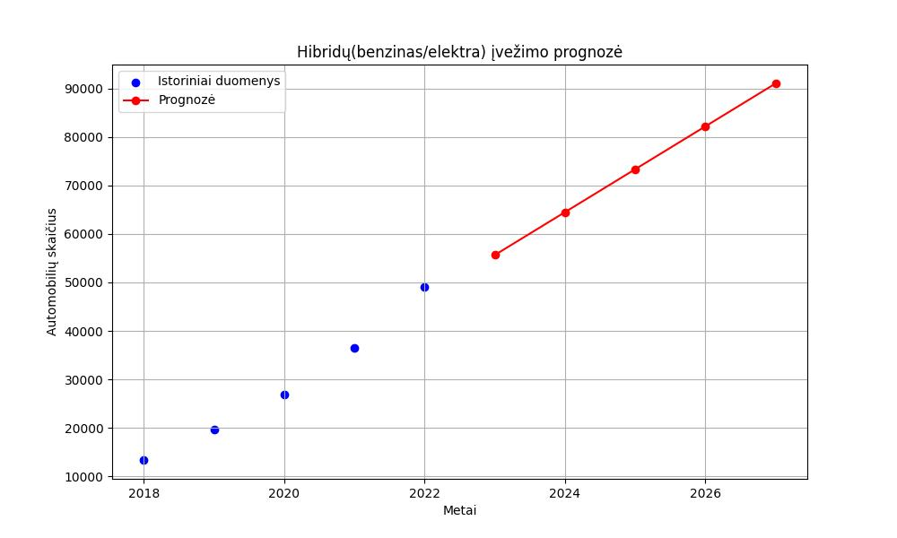

VILNIUS CODING SCHOOL BAIGIAMASIS DARBAS

## Į LIETUVĄ NAUJAI ĮVEŽAMŲ TRANSPORTO PRIEMONIŲ ANALIZĖ

Darbo vadovas: Modestas Viršila

Atliko: Dalia Rudytė, Inga Milienė

Pateikimo data: 2023-10-16

#### BAIGIAMOJO DARBO DETALIZAVIMAS:

TIKSLAS: _NUSTATYTI NAUJAI Į LIETUVĄ ĮVEŽAMŲ TRANSPORTO PRIEMONIŲ APIMTIS, SEZONIŠKUMĄ, POPULIARIAUSIAS MARKES
IR, NAUDOJANT ISTORINIUS DUOMENIS, ĮVERTINTI ATEITIES TRANSPORTO PRIEMONIŲ IMPORTO TENDENCIJAS PAGAL AUTOMOBILIŲ
TVARUMĄ APLINKOS KAITAI_

### ETAPAI:

AUTOMATINIS DUOMENŲ TRAUKIMAS IŠ TINKLALAPIO;

DUOMENU SUTVARKYMAS (LENTELĖS);

LYGINAMOJI DUOMENŲ ANALIZĖ 2021/2022 M.;

ATEITIES PROGNOZĖ IKI 2027 M.

#### DUOMENŲ ŠALTINIAI:
https://www.regitra.lt/lt/atviri-duomenys/

#### NAUDOTOS BIBLIOTEKOS:
BeautifulSoup,
requests,
pandas,
matplotlib,
sklearn.linear_model,
numpy

Teksto redaktorius: markdown

### DUOMENŲ SURINKIMAS:

Duomenų ištraukimui iš tinklapio https://www.regitra.lt/lt/atviri-duomenys/ naudoti BeautifulSoup, 
requests bibliotekos ir analizės įrankis "html.parser".
Kadangi tame pačiame tinklalapyje buvo keletas skirtingų lentelių, turinčių tą pačią klasę, buvo
panaudotos "if" ir "for" funkcijos, kad automatiškai ištrauktume visų analizei reikalingų lentelių duomenis.
Surandamos visos lentelės su nurodyta klase:
tables = soup.find_all('table', class_='grey large left')
find_all funkcija ieško visų elementų su nurodytu žymeniu ('table') ir klase ('grey large left').
Ištrauktiems duomenims apdoroti ir parengti tolimesnei analizei, panaudota Pandas DataFrame duomenų
struktūra.

df = pd.DataFrame(data, columns=column_names)

Transformuoti duomenys išsaugoti csv formatu.

df.to_csv('automobiliu_registracija_2021.csv')

df.to_csv('automobiliu_registracija_2022.csv')

Dviejų metų iš viso į Lietuvą naujai įvežamų transporto priemonių dinamika pamėnesiui
atvaizduota grafiškai, naudojant matplotlib biblioteką

### SEZONISKUMO TYRIMAS

**TIKSLAS:** _PATIKRINTI, AR EGZISTUOJA AUTOMOBILIŲ IMPORTO SEZONIŠKUMAS: 2021/2022__

Pritaikius funkciją pd.read_csv, atliktas reikalingų failų duomenų nuskaitymas ir 
sudėties veiksmas, nustatyti top 5 mėnesiai, kuriais
įvežama daugiausiai transporto priemonių ir iš jų - M1 klasės automobilių.

**IŠVADA:** _ATLIKUS DUOMENŲ ANALIZĘ, MATYTI, KAD YRA TAM TIKRI MĖNESIAI, KADA DAUGIAUSIAI ĮREGISTRUOJAMA NAUJAI 
ĮVEŽTŲ TRANSPORTO PRIEMONIŲ. TAI - PAVASARIS IR VASAROS PRADŽIA, TODĖL GALIMA TEIGTI, KAD LIETUVOJE EGZISTUOJA ĮVEŽAMŲ 
PIRMĄKART TRANSPORTO PRIEMONIŲ IMPORTO SEZONIŠKUMAS, KURIS GALI BŪTI SUSIJĘS SU AUTOMOBILIŲ PARDAVIMO AKCIJOMIS,
NAUJŲ MODELIŲ PRISTATYMU AR KITAIS SEZONINIAIS VEIKSNIAIS KAIP PVZ. MOTOCIKLŲ IR MOPEDŲ IMPORTO PADIDĖJIMU BALANDŽIO-
BIRŽELIO MĖN._

Nustatyti 3 mėnesiai, kuomet mažiausiai įvežama transporto priemonių:

Naudojant MATPLOTLIB bibliotekos galimybes, pateikiamos skirtingos tų pačių duomenų vizualizacijos:
linijinis/stulpelinis/suminis dviejų metų stulpelinis grafikai:

**IŠVADA:** _PALYGINUS 2021-2022 METUS, MATYTI, KAD NAUJAI ĮVEŽTŲ TRANSPORTO PRIEMONIŲ SEZONIŠKUMO 
TENDENCIJA IŠLIEKA PANAŠI._

### NAUJŲ IR NAUDOTŲ TRANSPORTO PRIEMONIŲ SANTYKIS

**TIKSLAS:** _PALYGINTI, KIEK IŠ VISO REGISTRUOTA NAUJŲ IR
NAUDOTŲ TRANSPORTO PRIEMONIŲ 2021 IR 2022 METAIS_

Pritaikius funkciją pd.read_csv, atliktas reikalingų failų duomenų nuskaitymas. 

Sukuriama duomenų seka, panaudojant indeksus:

index = range(len(pd.read_csv(data_files[0][0], skipfooter=1, engine='python')['Menuo']))

"For" funkcija naudojama, siekiant gražinti tiek indeksus, tiek elementus iš iteruojamo
sąrašo: "for i, (data_file, year) in enumerate(data_files):"

Duomenų vizualizacijai naudota Matplotlib biblioteka

**IšVADA:** _ANALIZUOJANT PAMĖNESIUI MATYTI, KAD Į LIETUVĄ ĮVEŽAMA  BEVEIK DVIGUBAI DAUGIAU
NAUDOTŲ, NEI NAUJŲ TRANSPORTO PRIEMONIŲ_

**TIKSLAS:** _NUSTATYTI, KOKIA YRA NAUJŲ AUTOMOBILIŲ PROCENTINĖ DALIS
NUO VISŲ REGISTRUOTŲ AUTOMOBILIŲ 2021/2022 METAIS_

Duomenų analizei naudota Pandas DataFrame struktūra, "for", "sum" ir "append"
funkcijos, procentų skaičiavimas.

**IŠVADA:** _ANALIZUOJANT METINIUS DUOMENIS MATYTI, KAD Į LIETUVĄ ĮVEŽAMA  TIK TREČDALIS NAUJŲ 
TRANSPORTO PRIEMONIŲ NUO IŠ VISO PER METUS ĮVEŽAMŲ._

###  POPULIARIAUSIOS NAUJOS IR NAUDOTOS M1 KLASĖS TRANSPORTO PRIEMONIŲ MARKĖS LIETUVOJE

**TIKSLAS:** _NUSTATYTI, KOKIOS NAUJOS M1 KL. AUTOMOBILIŲ MARKĖS YRA POPULIARIAUSIOS LIETUVOJE
IR KOKIĄ PROCENTINĘ DALĮ JOS SUDARO NUO VISŲ ĮVEŽAMŲ NAUJŲ TRANSPORTO PRIEMONIŲ_

Atliktas pradinių duomenų transformavimas tolesnei analizei: prie naujų populiariausių markių 2021/2022 
pridėtas stulpelis su visais pirkimais pamėnesiui iš transporto priemonių registracijos 
2021/2022, naudojant Pandas DataFrame struktūrą.

**IŠVADA:** _2021/2022 LYGINAMOJI ANALIZĖ PARODO, KAD VYRAUJA TOS PAČIOS MARKĖS, TAČIAU 2022 M. TOYOTA 
POPULIARUMAS IŠAUGO DEL ĮMONĖS VYKDOMOS INTENSYVIOS AKCIJŲ POLITIKOS IR DĖL
IŠPLĖSTOS HIBRIDINIŲ TRANSPORTO PRIEMONIŲ PASIŪLOS IR PALANKIŲ FINANSAVIMO SĄLYGŲ._

**TIKSLAS:** _NUSTATYTI, KOKIOS NAUDOTŲ TRANSPORTO PRIEMONIŲ MARKĖS YRA POPULIARIAUSIOS LIETUVOJE
IR KOKIĄ PROCENTINĘ DALĮ JOS SUDARO NUO VISŲ ĮVEŽAMŲ NAUDOTŲ TRANSPORTO PRIEMONIŲ_

**IŠVADA:** _NAUDOTŲ M1 KL. AUTOMOBILIŲ SEGMENTE DOMINUOJA VOKIŠKOS MARKĖS SU TARŠESNIAIS
GAMTAI VIDAUS DEGIMO VARIKLIAIS._

## PROGNOZES:

**TIKSLAS:** _ATLIKTI NAUJŲ ĮVEŽAMŲ TRANSPORTO PRIEMONIŲ BEI KLIMATO KAITAI TVARESNIŲ ĮVEŽAMŲ 
TRANSPORTO PRIEMONIŲ PROGNOZĘ ATEINANTIEMS 5 METAMS_

Naudotos šios bibliotekos: pandas, matplotlib, sklearn.linear_model, numpy.
Naudotas tiesinės regresijos metodas is "sklearn" bibliotekos.
Tiesinė regresija yra statistinis metodas, kuriuo randamas tiesinis ryšis tarp kintamųjų. 

**IŠVADA:** _NAUDOJANT TIESINĖS REGRESIJOS PROGNOZAVIMO METODĄ, MATYTI, KAD IŠLIEKA
NAUJŲ TRANSPORTO PRIEMONIŲ ĮVEŽIMO MAŽĖJIMO TENDENCIJA. ISTORIŠKAI RODIKLIAMS ĮTAKOS
TURĖJO: PANDEMIJA, PUSLAIDININKIŲ DEFICITAS, UKRAINOS KARAS, EURIBOR KILIMAS
IR INFLIACIJA_

**IŠVADA:** _NAUDOJANT TIESINĖS REGRESIJOS PROGNOZAVIMO METODĄ, MATYTI, KAD LIETUVOJE IR TOLIAU
IŠLIKS ELEKTRINIŲ IR HIBRIDINIŲ TRANSPORTO PRIEMONIŲ AUGIMO TENDENCIJA ATEINANČIUS
PENKERIUS METUS DĖL KLIMATO KAITOS PROGRAMŲ ĮGYVENDINIMO_